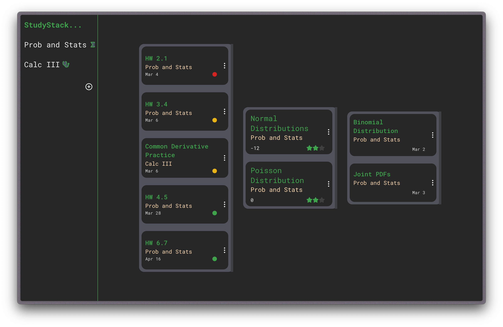
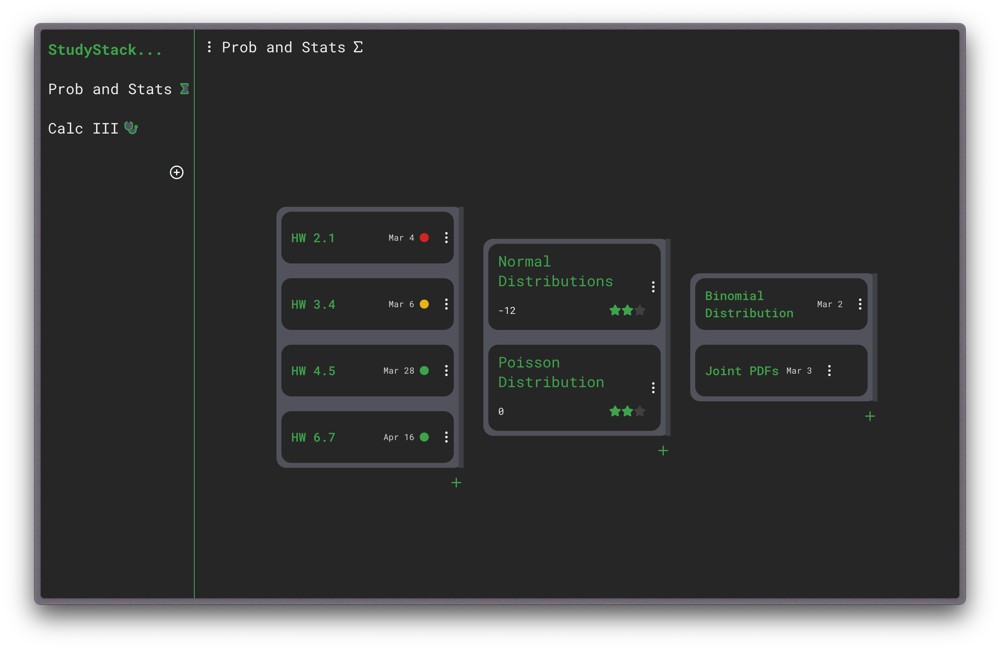
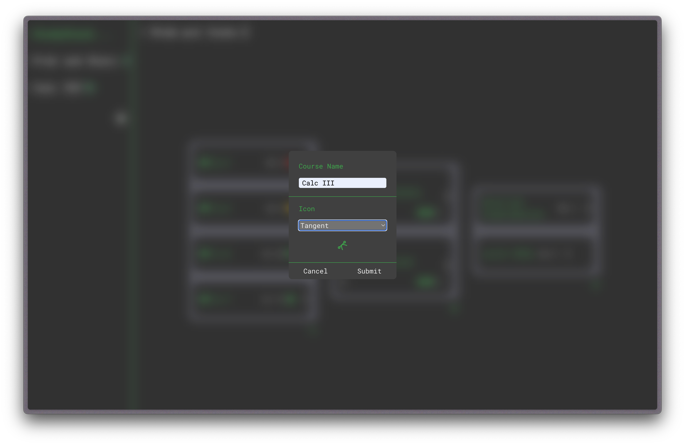
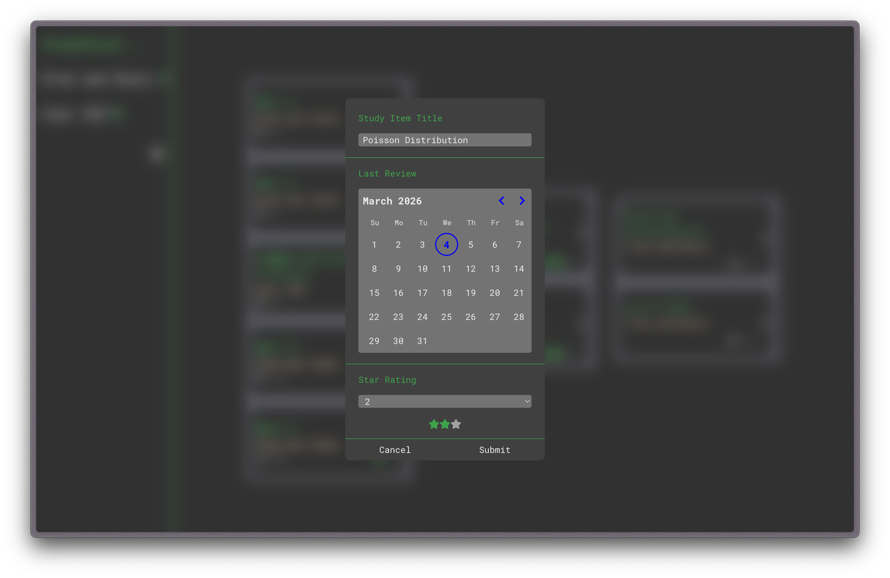

# StudyStack

A full-stack study management application that helps students organize coursework, track assignments, and prioritize studying through intelligent automation. Built with a modern web stack featuring a smart priority algorithm and Kanban-style task management.







## Features

**Assignment Management**
- Kanban-style board for tracking assignment status and progress
- Smart priority algorithm that ranks tasks based on due dates, self-assessed understanding scores, and review recency

## Usage

StudyStack organizes your coursework into three core item types:

- **Assignments** — Tasks with due dates. These feed into the priority algorithm so the most urgent work always surfaces first.
- **Learn Items** — Material covered in class that you haven't fully digested yet. Use these to flag topics you need to sit down and work through.
- **Study Items** — Content you've already learned but need to review for memory recall. Track when you last reviewed each item to stay on top of retention.

The Kanban board is laid out in three columns: **Assignments** on the left, **Study Items** in the middle, and **Learn Items** on the right. You can move items through stages as you progress, and the priority algorithm automatically ranks everything based on due dates, your self-assessed understanding, and how recently you reviewed. 

## Tech Stack

| Layer | Technology |
|---|---|
| Frontend | React, Next.js (App Router), Tailwind CSS |
| Backend | TypeScript, Next.js API Routes |
| Database | Supabase (PostgreSQL) |
| ORM | Drizzle ORM |
| Deployment | Vercel |
| Forms & Validation | react-hook-form, Zod |

## Getting Started

### Prerequisites

- Node.js 18+
- npm or yarn
- A Supabase project

### Installation

1. Clone the repository:
   ```bash
   git clone https://github.com/your-username/studystack.git
   cd studystack
   ```

2. Install dependencies:
   ```bash
   npm install
   ```

3. Create a `.env.local` file in the project root with the following variables:
   ```env
   NEXT_PUBLIC_SUPABASE_URL=your_supabase_url
   NEXT_PUBLIC_SUPABASE_ANON_KEY=your_supabase_anon_key
   SUPABASE_SERVICE_ROLE_KEY=your_service_role_key
   DATABASE_URL=your_database_connection_string
   ```

4. Push the database schema:
   ```bash
   npx drizzle-kit push
   ```

5. Start the development server:
   ```bash
   npm run dev
   ```

6. Open [http://localhost:3000](http://localhost:3000) in your browser.

## License

MIT

## Author

Jorge Gonzalez — Computer Science & Mathematics, Northeastern University